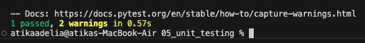

# Analisis Folder 05 : folder unit_testing (NIM : 123140172)

Percobaan kelima ini menerapkan pengujian unit untuk memverifikasi fungsionalitas view function aplikasi secara terisolasi. Setiap tes harus menjadi unit yang berdiri sendiri dan tidak dipengaruhi oleh tes lain. Inilah sebabnya mengapa view function diimpor di dalam fungsi tes (test_hello_world). Lalu, percobaan ini memastikan bahwa logika tes hanya berfokus pada fungsionalitas yang spesifik. Alat bantu pyramid.testing digunakan untuk menciptakan lingkungan tiruan dan objek DummyRequest yang meniru permintaan HTTP yang sebenarnya.

Pada percobaan ini, tes nya idak memerlukan server web yang sebenarnya (Waitress) untuk berjalan, melainkan mensimulasikan interaksi client-server. Setelah membuat request palsu, tes memanggil view secara langsung dan segera mengecek objek response yang dikembalikan. Assertion kunci dalam tes adalah memverifikasi response.status_code untuk memastikan nilainya adalah 200 (OK), membuktikan bahwa view mengembalikan respons yang valid tanpa adanya error logis. Hasil 1 passed yang dikeluarkan oleh pytest adalah konfirmasi langsung bahwa logika view Anda bekerja sesuai kontrak yang diharapkan.

Meskipun pengujian menggunakan helpers seperti pyramid.testing.setUp(), dokumentasi mencatat bahwa penggunaan setup dan teardown ini hanya wajib ketika view memiliki dependensi pada konfigurasi Pyramid yang kompleks. Dengan demikian, intinya percobaan 5 ini berhasil memisahkan proses pengujian dari proses eksekusi aplikasi, serta menghasilkan pengujian yang cepat dan terisolasi.
