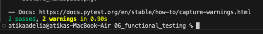

# Analisis Folder 06 : folder functional_testing (NIM : 123140172)

Percobaan keenam ini sebenernya meningkatkan strategi pengujian dari folder unit testing yang terisolasi menjadi functional testing, menggunakan paket WebTest. Melalui WebTest, percobaan ini mampu mensimulasikan request HTTP penuh terhadap aplikasi WSGI yang sudah dikonfigurasi, memungkinkan verifikasi seluruh tumpukan aplikasi, termasuk routing, pemrosesan view, dan konten HTML aktual. Pemasangan WebTest ke dalam extra [dev] di setup.py menunjukkan bagaimana alat pengujian tingkat tinggi dapat dengan mudah diperluas pada pytest yang sudah ada. Kemudian, pada percobaan functional testing ini memiliki kemampuan untuk menguji konten respons aktual, seperti mencari string "Hello World" tanpa perlu menjalankan server HTTP yang sebenarnya. Hasil run the test : 
