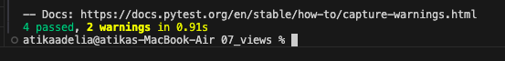
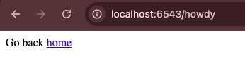

# Analisis Folder 07 : folder views (NIM : 123140172)

Percobaan ketujuh ini lebih menjelaskan tentang refactoring fundamental untuk menjaga kebersihan Python Package aplikasi dengan memisahkan kode konfigurasi dari kode logika view. Kode view dan pendaftarannya dipindahkan dari tutorial/__init__.py ke module terpisah views.py. Inti dari perubahan ini adalah pemanfaatan config.scan('.views') di dalam __init__.py. Perintah config.scan ini secara otomatis mencari decorator pendaftaran (@view_config) di dalam module yang ditunjuk (.views), sehingga tidak perlu lagi memanggil config.add_view() dan config.add_route() untuk setiap view di file utama.

Kalau metode sebelumnya, config.add_view, yaitu harus memberi tahu Pyramid apa yang harus dilakukan. Maka, kalau metode pada percobaan ini, yaitu @view_config akan melakukan decorator pada fungsi view di views.py. Sebenernya, kedua metode itu sama saja, yaitu tetapi, pendekatan pada percobaan ini lebih memudahkan untuk melihat konfigurasi route yang lebih tepat di code view terkait. 

Percobaan ini juga memperluas routing aplikasi dengan menambahkan dua view (/ dan /howdy) yang saling terhubung. Hal ini menunjukkan bahwa nama URL, nama route, dan nama view function dapat sering kali berbeda. Meskipun namanya berbeda-beda, routing dan pemisahan view yang kini lebih memungkinkan arsitektur aplikasi Pyramid menjadi lebih terstruktur dan siap untuk skala yang lebih besar, dengan view logic tersimpan di module yang terpisah.

Tampilan hasil run the test : 

Tampilan di localhost:6543 : 

Tampilan di localhost:6543/howdy : 

 
