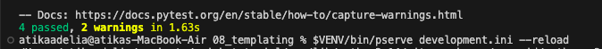
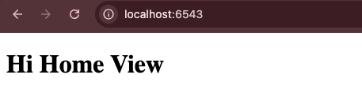

# Analisis Folder 08 : folder templating (NIM : 123140172)

Percobaan kedelapan ini melakukan pemisahan logika data (Python) dari logika presentasi (Template). Perubahan terletak pada decorator @view_config yang sudah mencakup penentu renderer yang menunjuk ke file template eksternal. View function hanya bertugas memproses data dan mengembalikan kamus (dictionary) data Python yang berisi informasi yang dibutuhkan. Pyramid secara otomatis mengambil data dari kamus yang dikembalikan tersebut, meneruskannya ke renderer yang ditentukan dan kemudian merangkai hasilnya menjadi respons HTML yang lengkap.

Karena di percobaa ini menyalin file dari percobaan 07, maka pada kode views menjadi lebih bersih karena hanya berfokus pada logika Python dan pengambilan data, bukan pada sintaks HTML. Kemudian, proses testing menjadi lebih efisien. Karena pada percobaan 07_views hanya mengembalikan struktur data (kamus) sehingga hanya memastikan view menghasilkan data yang benar tanpa perlu memverifikasi markup HTML yang kompleks. Dengan demikian, pada folder percobaan sebelumnya, yaitu 07_views sekarang hanya berbasis data yang stabil, sementara file 08_template dapat diubah tanpa merusak test nya. 

Tampilan hasil run the test : 

Tampilan di localhost:6543 : 

Tampilan di localhost:6543/howdy : 

 
