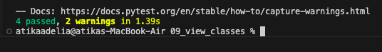
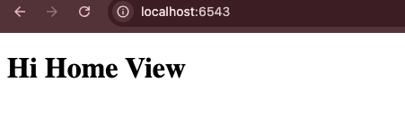

# Analisis Folder 09 : folder view vlasses (NIM : 123140172)

Pada percobaan kesembilan sebenernya bertujuan untuk mengubah view function berbasis fungsi menjadi view berbasis kelas. Meskipun view function sangat efisien untuk view sederhana, view berbasis kelas memberikan struktur yang lebih baik untuk aplikasi yang lebih besar, terutama ketika view tersebut perlu mengakses state bersama atau melakukan tindakan setup yang kompleks.

Perubahan yang ada pada percobaan kesembilan ini terjadi pada cara request HTTP diakses, yaitu dibandingkan meneruskan request sebagai argumen ke setiap fungsi, request-nya sekarang dapat diakses melalui metode setup kelas (__init__) dan di-bind sebagai self.request. Dengan demikian, metode view di dalam kelas, seperti home atau hello dapat mengakses semua data yang diperlukan melalui self.request tanpa perlu menerimanya secara eksplisit. Pendaftaran view masih dilakukan secara deklaratif melalui @view_config di atas setiap metode kelas, yang secara otomatis memberi tahu Pyramid metode mana yang harus dipanggil. Dengan demikian, pada percobaan ini menghasilkan kerangka yang lebih kuat dan mudah diorganisir untuk code reuse dan manajemen state pada aplikasi yang kompleks.

Tampilan hasil run the test : 

Tampilan di localhost:6543 : 

Tampilan di localhost:6543/howdy : 

 
