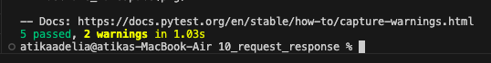
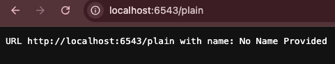

# Analisis Folder 10 : folder request_response (NIM : 123140172)

Percobaan kesepuluh ini menunjukkan bagaimana Pyramid, melalui library WebOb, memfasilitasi interaksi dengan request dan response HTTP. Perubahan signifikan dalam view berbasis kelas yang Anda buat adalah kemampuannya untuk mengambil data dari request dan memanipulasi response sebelum dikirim kembali ke klien.

Perubahan pada percobaan kesepuluh ini adalah menguatkan kontrol atas objek request dan response yang menjadi fondasi setiap interaksi client-server. View berbasis kelas yang sudahh dibuat sudah bisa mengambil data dari URL—misalnya, melalui self.request.params.get('name', ...). Kode ini tidak hanya mencari parameter name yang dikirim pengguna, tetapi juga menetapkan nilai default ("No Name Provided") jika parameter itu hilang.

Pada view home (di /) menunjukkan cara menghasilkan pengalihan (redirect) secara efisien dengan mengembalikan objek HTTPFound. Ini sama seperti memberikan catatan kepada browser yang bunyinya, "Saya tidak punya konten di sini, silakan cari di alamat ini". Kemudian, pada view plain menetapkan header respons menggunakan content_type='text/plain'. Langkah ini sangat penting karena ia memberitahu browser untuk menampilkan body respons sebagai teks mentah dan bukan mencoba menginterpretasikannya sebagai HTML yang penuh dengan tag.

Secara keseluruhan, percobaan ini memperkuat pemahaman bahwa view sekarang tidak hanya sekadar menampilkan "Hello World!", tetapi juga dapat membuat keputusan dan berinteraksi dengan data dinamis. 

Tampilan hasil run the test : 

Tampilan di localhost:6543 yang redirected ke localhost:6543/plain. : 

Tampilan di localhost:6543/plain?name=alice : 

 
