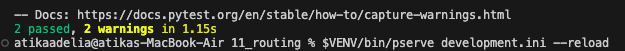
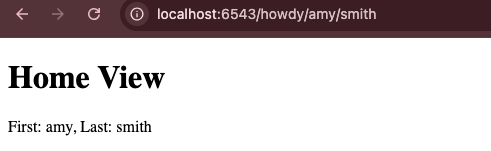

# Analisis Folder 11 : folder routing (NIM : 123140172)

Pada Percobaan kesebelas ini adalah tentang membuat URL yang dinamis. Pyramid memungkinkan untuk mendefinisikan pola penggantian (replacement pattern) di dalam deklarasi route, dan secara otomatis mengekstraksi nilainya untuk digunakan di kode view.

Perubahan yang signifikan yang ada pada percobaan kesebelas ini adalah terletak pada file tutorial/__init__.py saat mendeklarasikan route : 
```python
config.add_route('home', '/howdy/{first}/{last}') 

Setiap segmen yang diapit kurung kurawal ({first} dan {last}) secara otomatis dikenali sebagai variabel

Pada percobaan ini route menggunakan pola penggantian (replacement pattern), yaitu segmen yang diapit kurung kurawal, seperti /howdy/{first}/{last} yang mana memberi tahu Configurator bahwa segmen URL tersebut harus ditangkap sebagai variabel. Misalnya, jika browser mengakses /howdy/amy/smith, Pyramid akan secara otomatis mencocokkan amy ke kunci first dan smith ke kunci last. Data yang berhasil diekstrak dari URL ini tidak tersedia di query string biasa, melainkan disimpan dalam self.request.matchdict. Berikut adalah tampilan saat membuka localhost:6543/howdy/amy/smith: 

Tampilan hasil run the test : 



Tampilan di localhost:6543/howdy/amy/smith: 

