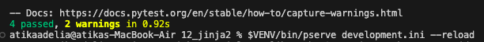
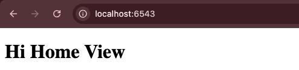

# Analisis Folder 12 : folder jinja2 (NIM : 123140172)

Pada percobaan keduabelas ini menggunakan jinja2 sebagai mesin templating utama aplikasi Pyramid. Tujuannya adalah memisahkan kode yang bertanggung jawab atas logika presentasi (HTML) dari kode yang bertanggung jawab atas logika bisnis (Python).

Kemudian, pada percobaan ini fungsionalitasnya diaktifkan pada file tutorial/__init__.py melalui config.include('pyramid_jinja2'). Konfigurasi ini memberi tahu Pyramid untuk memuat renderer baru yang mampu memproses file .jinja2, mengubah view Anda dari produsen HTML menjadi produsen data.

Perubahan paling signifikan terjadi pada view function yang kini hanya berfokus pada kontrak data (data contract). View berbasis kelas tidak lagi mengembalikan objek Response yang berisi string HTML yang sudah jadi. Sebaliknya, view tersebut hanya mengembalikan kamus data Python (misalnya, {'project': 'Nama Proyek Anda'}). Pendaftaran view melalui @view_config dimodifikasi untuk menyertakan penentu renderer='tutorial:templates/...', yang mengarahkan data kamus tersebut ke file template yang sesuai. Jinja2 kemudian bertugas mengambil data tersebut dan merangkainya menjadi respons HTML akhir yang dikirim ke browser.

Pemisahan ini memiliki manfaat langsung pada proses testing dan pemeliharaan kode. Karena view kini hanya menghasilkan data, lalu pengujiannya juga hanya perlu memverifikasi bahwa view menghasilkan struktur data yang benar. Berikut adalah tampilan hasil test dan di localhost nya 

Tampilan hasil run the test : 

Tampilan di localhost:6543 : 

