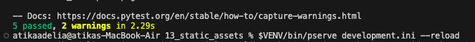
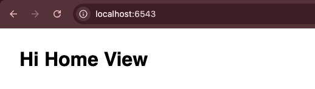

# Analisis Folder 13 : folder static assets  (NIM : 123140172)

Pada percobaan ini mengajarkan prinsip penting dalam pengembangan web, yaitu bagaimana memetakan file yang ada di disk (seperti CSS, JavaScript, atau gambar) ke URL yang dapat diakses oleh browser. Inti dari implementasinya adalah penggunaan helper konfigurasi config.add_static_view.

Kemudian, untuk mengatur asset static nya dilakukan dengan memisahkan antara *file* di *disk* dan URL yang dapat diakses di *web*. Ini diimplementasikan di file **`tutorial/__init__.py`** menggunakan perintah:
```python
config.add_static_view(name='static', path='tutorial:static')
```
Pada path='tutorial:static' mendefinisikan lokasi fisik aset kita di dalam Python Package. Lalu, pada name='static' menunjukkan pada URL prefix yang diakses oleh browser. Semua file kini tersedia melalui URL yang dimulai dengan /static/ (misalnya, /static/app.css). Perintah ini mengubah server WSGI Pyramid menjadi server aset. 

Kemudian, pada percobaan ini menggunakan request.static_url, berikut perintahnya : 
```python
${request.static_url('tutorial:static/app.css')}
```
keunggulan dari request.static_url ni secara otomatis menghasilkan URL yang benar berdasarkan konfigurasi config add_static_view. 

Kemudian, pada file test.py juga ditambahkan pengujian fungsionalnya, berikut perintahnya : 
```python
res = self.testapp.get('/static/app.css', status=200) 
self.assertIn(b'body', res.body)
```
Pengujian fungsional tersebut mensimulasikan permintaan HTTP, memverifikasi bahwa respons mengembalikan Status Code 200 (OK), dan yang lebih penting, mengonfirmasi bahwa body respons (res.body) memang berisi konten file CSS (b'body') dan bukan pesan error. Ini menjamin bahwa aset statis berhasil dikirimkan. Berikut adalah tampilan hasil testnya dan tampilan di localhost : 

Tampilan hasil run the test : 



Tampilan di localhost:6543 : 

s