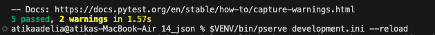
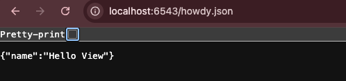
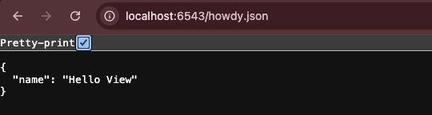

# Analisis Folder 14 : folder json (NIM : 123140172)

Pada percobaan keempat belas ini mengubah aplikasi Pyramid agar dapat melayani data terstruktur dalam format **JSON** sebagai output utama, bukan HTML. Ini adalah langkah kunci dalam membuat endpoint API. Percobaan ini merupakan pergeseran dari rendering presentasi (HTML/Jinja2) ke penyediaan data mentah. Alih-alih mengembalikan objek yang perlu diproses oleh template engine, view function, sekarang hanya mengembalikan struktur data Python, seperti dictionary. Kunci dari *JSON View* adalah penentu `renderer='json'` pada *decorator* **`@view_config`**, berikut adalah perintahnya : 
```python
@view_config(route_name='home', renderer='json')
```
Ketika view mengembalikan dictionary atau list Python, Pyramid melihat penentu renderer='json'. Secara otomatis, Pyramid mengambil struktur data tersebut, mengubahnya menjadi string JSON yang valid, dan mengirimkannya ke browser atau klien API. Pyramid juga secara otomatis menetapkan application/json pada response HTTP, memastikan klien mengetahui cara menginterpretasikan data yang diterimanya.

Kemudian, pada percobaan ke empat belas ini juga menjelaskan bagaimana Pyramid mendukung routing melalui penggunaan view predicates. View predicates memungkinkan developer untuk menggunakan URL yang sama untuk melayani respons yang berbeda berdasarkan header yang dikirim oleh client, seperti header Accepts: application/json yang digunakan oleh client AJAX (JavaScript) dengan menggunakan predicate ini, dapat menginstruksikan Pyramid: "Jika permintaan masuk ke URL /data DAN meminta JSON, gunakan view JSON; jika tidak, gunakan view HTML default.". Berikut adalah tampilan hasil testnya dan di localhost : 

Tampilan hasil run the test : 



Tampilan di http://localhost:6543/howdy.json : 



 
