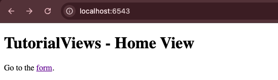
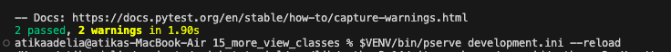
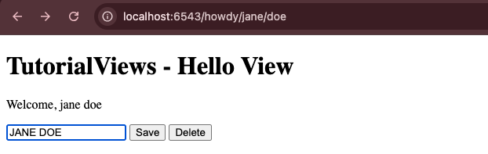
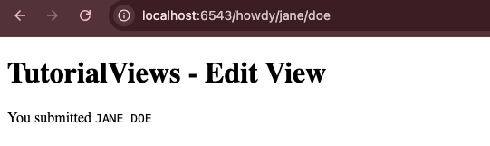
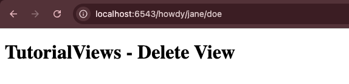

# Analisis Folder 15 : folder more view classes (NIM : 123140172)

*We have a home view available at http://localhost:6543/ with a clickable link to the hello view*. Berikut adalah tampilannya saat membuka localhost:6543

Percobaan kelima belas ini menerapkan dua teknik refactoring lanjutan, yang pertama adalah penggunaan decorator @view_defaults pada view class, secara signifikan mengurangi kode berulang yang sebelumnya mencemari setiap metode. Kedua, percobaan ini memperkenalkan Templating Inheritance (pewarisan template) untuk mengatasi redundansi HTML. Daripada mengulang markup dasar (<html>, <head>, header, footer) di setiap file template individual, membuat layout master (misalnya, layout.jinja2) yang berisi semua struktur HTML umum dan menggunakan Jinja2 blocks () sebagai placeholder. View template spesifik kemudian mewarisi struktur ini dengan menggunakan tag  dan hanya mengisi konten unik mereka di dalam block yang relevan. Refactoring ini memastikan bahwa layout situs Anda konsisten, dan perubahan desain global—seperti memperbarui CSS atau JavaScript—hanya perlu dilakukan sekali pada file. 

Secara keseluruhan, Percobaan 15 ini bukan tentang menambah fungsionalitas baru, melainkan tentang meningkatkan skalabilitas view dan templating aplikasi. Berikut adalah tampilan hasil test dan di localhost : 

Tampilan hasil run the test : 

Tampilan di http://localhost:6543/howdy/jane/doe, 

tampilan saat edit : 

tampilan hasil edit  : 

 

tampilan saat delete : 

 
