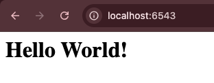

# Analisis Folder 01 : hello_world (NIM : 123140172)

1. Line 11. The if __name__ == '__main__': is Python's way of saying, "Start here when running from the command line", rather than when this module is imported.

    Analisis : Code baris 11 memastikan bahwa semua kode di bawahnya hanya akan dijalankan ketika file app.py dijalankan secara langsung dari command line ($VENV/bin/python app.py) di terminal Vscode. 

2. Lines 12-14. Use Pyramid's configurator in a context manager to connect view code to a particular URL route.

    Analisis : Kode baris 12-14 menggunakan objek Configurator Pyramid di dalam context manager untuk menyelesaikan proses konfigurasi aplikasi dengan menyambungkan view ke URL.

3. Lines 6-8. Implement the view code that generates the response.

    Analisis : Code baris 6-8 mengimplementasikan fungsi View (hello_world), jadi intinya code tersebut yang bertanggung jawab untuk keluaran yang dikirim ke browser. 

4. Lines 15-16. Publish a WSGI app using an HTTP server.

    Analisis : Pada code 15-16 dibuat objek aplikasi WSGI (Web Server Gateway Interface) yang menggunakan server HTTP bernama Waitress untuk memublikasikan aplikasi WSGI tersebut, di mana Waitress bertindak sebagai perantara yang mendengarkan permintaan HTTP masuk pada port yang ditentukan, yaitu 6543 dan meneruskannya ke aplikasi Pyramid untuk diproses.

Tampilan di localhost 
